# Hướng dẫn cài đặt backend KYC local

## 1. Requirements
- OS: Ubuntu 18.04, 20.04
- CPU: 4 Cores
- RAM: 8GB
- SSD: 128GB

## 2. Cài đặt các package cần thiết
### 2.1. Docker

Cập nhật `apt` package:
```sh
sudo apt-get update
sudo apt-get install ca-certificates curl gnupg lsb-release
```

Thêm docker GPG key vào `apt`:
```sh
sudo mkdir -p /etc/apt/keyrings
curl -fsSL https://download.docker.com/linux/ubuntu/gpg | sudo gpg --dearmor -o /etc/apt/keyrings/docker.gpg
```

Add docker repo:
```sh
echo \
  "deb [arch=$(dpkg --print-architecture) signed-by=/etc/apt/keyrings/docker.gpg] https://download.docker.com/linux/ubuntu \
  $(lsb_release -cs) stable" | sudo tee /etc/apt/sources.list.d/docker.list > /dev/null
```

Cài đặt docker:
```sh
sudo apt-get update
sudo apt-get install docker-ce docker-ce-cli containerd.io docker-compose-plugin
```

Test: 
```sh
docker -v
```
Thấy hiện phiên bản docker là thành công:

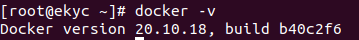

### 2.2 Docker Compose
Tải docker-compose binary file:
```sh
wget https://github.com/docker/compose/releases/download/v2.4.1/docker-compose-linux-x86_64
```

Tạo symbolic link để chạy docker-compose command:
```
mv docker-compose-linux-x86_64 /usr/local/bin/docker-compose
chmod +x /usr/local/bin/docker-compose
ln -s /usr/local/bin/docker-compose /usr/bin/docker-compose --force
```

Test:
```sh
docker-compose -v
```
Thấy hiện phiên bản docker-compose là thành công:

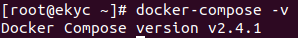

## 3. Triển khai backend

### 3.1. Clone code từ github
```sh
git clone https://github.com/hoangph3/face-kyc-api
```

### 3.2. Build và run container from source

Cấu hình biến môi trường trong file `docker-compose.yml`:

```yaml
api:
  build: .
  image: hoangph3/face-kyc-api:1.0.0
  container_name: face_kyc_api
  volumes:
    - ./api-data:/app/model
  depends_on:
    - redis
  network_mode: host
  environment:
    - API_HOST=127.0.0.1
    - API_PORT=8999
    - DIM_MODEL=128
    - METRIC_MODEL=cosine
    - MATCHED_SCORE=0.90
    - SERVING_URL=http://127.0.0.1:8501/api/user/pattern
    - MONGO_USER=admin
    - MONGO_PASSWORD=P4ssW0rD
    - MONGO_PORT=17017
    - REDIS_PORT=16379
```

Trong đó:
- `API_HOST`: host của service chạy backend (mặc định là `127.0.0.1`).
- `API_PORT`: port của service chạy backend (mặc định là `8999`, trường hợp port này đã bị service khác chiếm thì cần phải sửa thành port khác, ví dụ: `9000`, `9001`, ...)
- `DIM_MODEL`: số chiều của vector khuôn mặt (phụ thuộc vào mô hình AI).
- `METRIC_MODEL`: metric tính khoảng cách (`cosine` hoặc `euclidean`, phụ thuộc vào mô hình AI).
- `MATCHED_SCORE` : similarity score giữa 2 vectors (phụ thuộc vào mô hình AI).
- `SERVING_URL`: endpoint của model serving (phụ thuộc vào mô hình AI).
- `MONGO_USER`, `MONGO_PASSWORD` và `MONGO_PORT`: cấu hình của mongo database, xem ở service `mongodb` trong file `docker-compose.yml`.

```yml
mongodb:
    container_name: mongo_database
    image: mongo:6.0.1
    ports:
      - '17017:27017'
    environment:
      - MONGO_INITDB_ROOT_USERNAME=admin
      - MONGO_INITDB_ROOT_PASSWORD=P4ssW0rD
```

Ở đây ta có:
- `MONGO_USER` tương ứng với `MONGO_INITDB_ROOT_USERNAME`.
- `MONGO_PASSWORD` tương ứng với `MONGO_INITDB_ROOT_PASSWORD`.
- `MONGO_PORT` thì lấy port ở phía bên trái dấu `:` (mặc định là `17017`), trường hợp port này đã bị service khác chiếm thì cần phải sửa thành port khác.

- `REDIS_PORT`: port của message queue, xem ở service `redis` trong file `docker-compose.yml`. Chú ý lấy port ở phía bên trái dấu `:` (mặc định là `16379`), trường hợp port này đã bị service khác chiếm thì cần phải sửa thành port khác.

```yml
redis:
    container_name: redis_queue
    image: redis:7.0.4
    ports:
      - '16379:6379'
```

Sau khi cấu hình xong, chạy lệnh sau để deploy:

```sh
docker-compose up -d --build
```

Kiểm tra các image và container:
```sh
docker images
```
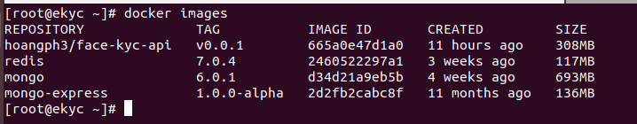
```sh
docker ps
```
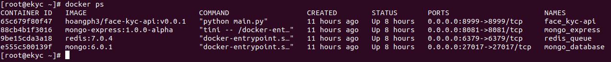

Kiểm tra log của backend:
```
docker logs -f face_kyc_api
```

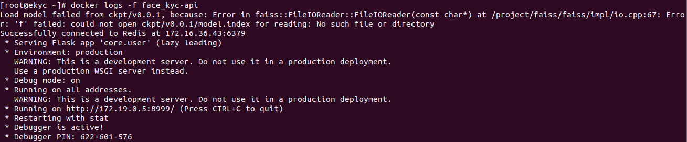

Trong phần log có thấy thông báo: `No such file or directory`, tuy nhiên chưa cần quan tâm vì sau khi deploy thì chưa có model indexing. Sau bước này có thể  đến mục 4. để test api luôn.

## 4. Test API

Để test các api được cấp có thể dùng Postman hoặc lệnh `curl`, mặc định sử dụng ip là `127.0.0.1`, nếu sử dụng ip local thì cần sửa lại ip tương ứng trong endpoint.

### 4.1. API đăng ký

API đăng ký là api giao tiếp giữa backend telehouse và backend của kotora.

- Endpoint: http://127.0.0.1:8999/api/user/pattern
- Method: POST
- Content-Type`: application/json
- Body:
```json
{
    "images": ["<image_1>", "<image_2>", "<image_3>", "<image_4>", "<image_5>"],
    "zcfg_requester_comboname": "<requester_fullname>",
    "zcfg_requester_organization": "<organization>",
    "zcfg_requester_address_email": "<requester_email>",
    "zcfg_requester_id_passport": "<cccd/cmnd>",
    "zcfg_requester_phone_number": "<phone_number>",
    "zcfg_requester_access_purpose": "<access_purpose>",
    "attachments": "<upload_files>",
    "zcfg_approver_comboname": "<approver_fullname>",
    "zcfg_approver_address_email": "<approver_email>",
    "zusing": true,
    "znot_using": false,
    "zstart_date": "<checkin_time>",
    "zend_date": "<checkout_time>",
    "ztask": "<task_name>"
}
```
- Response:
```json
{
    "message": "<message>",
    "connected": true
}
```

Tạo file `register.json` với nội dung:
```json
{
    "images": [],
    "zcfg_requester_comboname": "hoang",
    "zcfg_requester_organization": "kotora",
    "zcfg_requester_address_email": "hoang@gmail.com",
    "zcfg_requester_id_passport": "038585963",
    "zcfg_requester_phone_number": "0391408249",
    "zcfg_requester_access_purpose": "tour",
    "attachments": "",
    "zcfg_approver_comboname": "administrator",
    "zcfg_approver_address_email": "superadmin@telehouse.com",
    "zusing": true,
    "zstart_date": "2022-09-01 08:00:00",
    "zend_date": "2022-09-01 10:00:00",
    "ztask": "tour"
}
```
Test với lệnh `curl`:
```sh
curl -d @register.json -X POST http://172.16.36.43:8999/api/user/pattern -H "Content-Type: application/json"
```

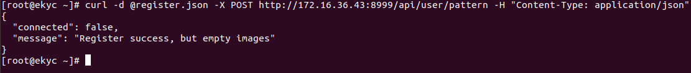

Trong đó: `connected` là thông báo kết nối từ backend kotora đến AI Box, do chưa có kết nối nên báo false, message đăng ký thành công nhưng trường `images` không chứa ảnh.

Sửa lại file `register.json` với nội dung:
```json
{
    "images": [],
    "zcfg_requester_comboname": "hoang",
    "zcfg_requester_organization": "kotora",
    "zcfg_requester_phone_number": "0391408249",
    "zcfg_requester_access_purpose": "tour",
    "attachments": "",
    "zcfg_approver_comboname": "administrator",
    "zcfg_approver_address_email": "superadmin@telehouse.com",
    "zusing": true,
    "zstart_date": "2022-09-01 08:00:00",
    "zend_date": "2022-09-01 10:00:00",
    "ztask": "tour"
}
```
Test với lệnh `curl`:
```sh
curl -d @register.json -X POST http://172.16.36.43:8999/api/user/pattern -H "Content-Type: application/json"
```

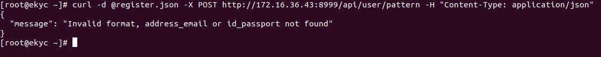

Backend yêu cầu thông tin 2 trường: `zcfg_requester_address_email` và `zcfg_requester_id_passport` để tạo `user_id` cho người dùng theo công thức: `hash_md5(<cccd/cmnd>+"_"+<email>)`. Vì payload trên không có 2 trường này nên báo lỗi.

Sửa lại file `register.json` với nội dung:
```json
{
    "images": [],
    "zcfg_requester_comboname": "hoang_pham",
    "zcfg_requester_organization": "kotora",
    "zcfg_requester_address_email": "hoang@gmail.com",
    "zcfg_requester_id_passport": "038585963",
    "zcfg_requester_phone_number": "0391408249",
    "zcfg_requester_access_purpose": "tour",
    "attachments": "",
    "zcfg_approver_comboname": "administrator",
    "zcfg_approver_address_email": "superadmin@telehouse.com",
    "zusing": true,
    "zstart_date": "2022-09-01 08:00:00",
    "zend_date": "2022-09-01 10:00:00",
    "ztask": "tour"
}
```
Test với lệnh `curl`:
```sh
curl -d @register.json -X POST http://172.16.36.43:8999/api/user/pattern -H "Content-Type: application/json"
```

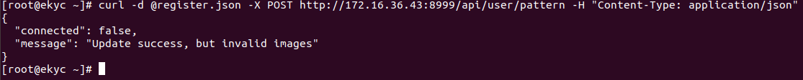

Update thông tin người dùng thành công, `invalid images` là do người dùng chưa có ảnh, hoặc ảnh không hợp lệ (AI box sẽ tiến hành verify), vấn đề này sau khi ghép nối với AI Box sẽ đánh giá sau.


### 4.2. API verify

API verify là api giao tiếp giữa backend và AI Box, cái này sẽ test sau.
- Endpoint: http://127.0.0.1:8999/api/user/pattern
- Method: PUT
- Content-Type: application/json
- Body:
```json
[
    {
        "face_images": ["<face_image_1>", "...", "<face_image_N>"],
        "gate_location": ["<gate_location_1>", "...", "<gate_location_N>"],
        "status": ["<status_1>", "...", "<status_N>"],
        "encodings": ["<encoding_1>", "...", "<encoding_N>"]
    },
    "...",
]
```
- Response:
```json
[
    [
        {
            "score": "<matching_score>",
            "user_id": ""
        },
        "...",
        {
            "face_images": "<face_image>",
            "gate_location": "<gate_location>",
            "score": "<matching_score>",
            "status": 1, //1 is checkin, 0 is checkout
            "timestamp": "%Y-%m-%d %H:%M:%S",
            "user_id": "<user_id>",
            "zcfg_requester_address_email": "<requester_email>",
            "zcfg_requester_comboname": "<requester_fullname>",
            "zcfg_requester_id_passport": "<cccd/cmnd>",
            "zcfg_requester_phone_number": "phone_number"
        }
    ],
    "...",
    [
        {
            "score": "<matching_score>",
            "user_id": ""
        },
        "...",
        {
            "face_images": "<face_image>",
            "gate_location": "<gate_location>",
            "score": "<matching_score>",
            "status": 1, //1 is checkin, 0 is checkout
            "timestamp": "%Y-%m-%d %H:%M:%S",
            "user_id": "<user_id>",
            "zcfg_requester_address_email": "<requester_email>",
            "zcfg_requester_comboname": "<requester_fullname>",
            "zcfg_requester_id_passport": "<cccd/cmnd>",
            "zcfg_requester_phone_number": "phone_number"
        }
    ]
]
```


### 4.3 API monitor log

Bên backend sẽ lưu lịch sử  các lần đăng ký, cập nhật thông tin cũng như xác minh (verify) người dùng. Bên telehouse có thể call API để lấy thông tin lịch sử.

- Endpoint: http://127.0.0.1:8999/api/user/monitor
- Method: POST, GET
- Content-Type: application/json
- Body:
```json
{
    "zcfg_requester_comboname": "<requester_fullname>",
    "zcfg_requester_organization": "<organization>",
    "zcfg_requester_address_email": "<requester_email>",
    "zcfg_requester_id_passport": "<cccd/cmnd>",
    "zcfg_requester_phone_number": "<phone_number>",
    "zcfg_requester_access_purpose": "<access_purpose>",
    "attachments": "<upload_files>",
    "zcfg_approver_comboname": "<approver_fullname>",
    "zcfg_approver_address_email": "<approver_email>",
    "zusing": true,
    "znot_using": false,
    "zstart_date": "<checkin_time>",
    "zend_date": "<checkout_time>",
    "ztask": "<task_name>"
}
```
- Response:
```json
{
    "register_logs": [
        {},
        "...",
        {}
    ],
    "verify_logs": [
        {},
        "...",
        {}
    ]
}
```

Query thông tin lịch sử  theo những trường cần lấy, ví dụ:

Tạo file `monitor.json` với nội dung:
```json
{
    "zcfg_requester_address_email": "hoang@gmail.com"
}
```
Test với lệnh `curl`:
```sh
curl -d @monitor.json -X GET http://172.16.36.43:8999/api/user/monitor -H "Content-Type: application/json"
```

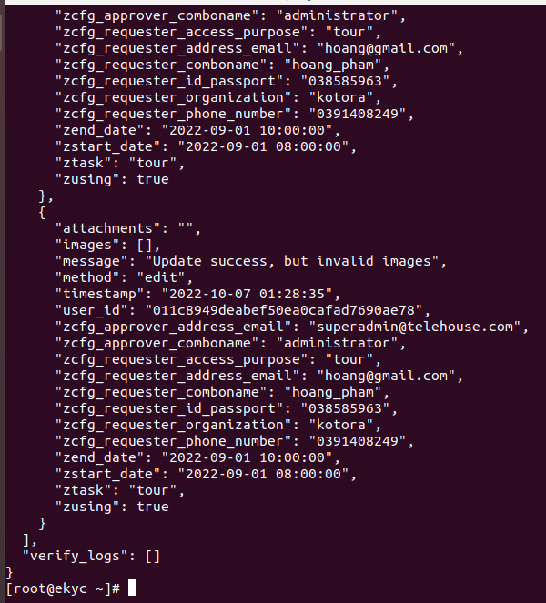


Ở đây giá trị trường method là add (register) hoặc là edit (update), verify logs không có.

Có thể test thêm bằng cách query theo các trường khác, ví dụ như: `zcfg_approver_comboname`, `zend_date`, `zstart_date`, ...

### 4.4 Xóa người dùng:

API xóa người dùng khỏi hệ thống

- Endpoint: http://127.0.0.1:8999/api/user/pattern
- Method: DELETE
- Content-Type`: application/json
- Body:
```json
{
    "zcfg_requester_address_email": "<requester_email>",
    "zcfg_requester_id_passport": "<cccd/cmnd>",
}
```
- Response:
```json
{
    "message": "<message>",
    "email": "<address_email>",
    "id_passport": "<id_passport>"
}
```

Tạo file `delete.json` với nội dung:
```json
{
    "zcfg_requester_address_email": "hoang@gmail.com",
    "zcfg_requester_id_passport": ""
}
```
Test với lệnh `curl`:
```sh
curl -d @delete.json -X DELETE http://172.16.36.43:8999/api/user/pattern -H "Content-Type: application/json"
```

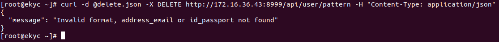

Lỗi do không đủ thông tin để xóa.

Sửa file `delete.json` với nội dung:
```json
{
    "zcfg_requester_address_email": "hoang@gmail.com",
    "zcfg_requester_id_passport": "038585963"
}
```
Test với lệnh `curl`:
```sh
curl -d @delete.json -X DELETE http://172.16.36.43:8999/api/user/pattern -H "Content-Type: application/json"
```

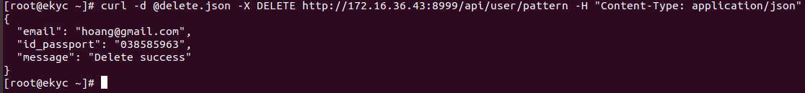

Test với lệnh `curl`:
```sh
curl -d @delete.json -X DELETE http://172.16.36.43:8999/api/user/pattern -H "Content-Type: application/json"
```

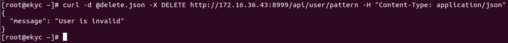

Lỗi do user không tồn tại.
