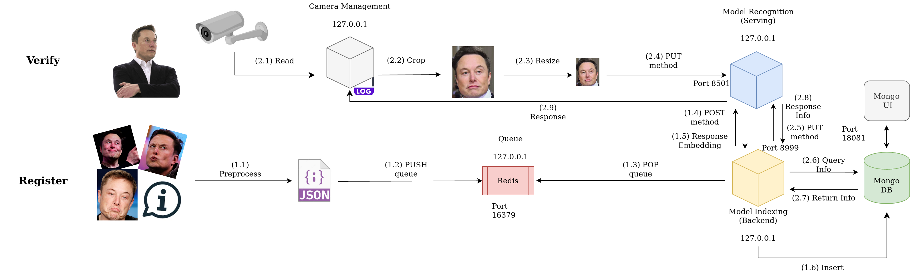

# Hướng dẫn cài đặt FaceKYC local



## 1. Requirements
- OS: Ubuntu 18.04, 20.04
- CPU: 4 Cores
- RAM: 8GB
- SSD: 128GB

## 2. Cài đặt các package cần thiết
### 2.1. Docker

Cập nhật `apt` package:
```sh
sudo apt-get update
sudo apt-get install ca-certificates curl gnupg lsb-release
```

Thêm docker GPG key vào `apt`:
```sh
sudo mkdir -p /etc/apt/keyrings
curl -fsSL https://download.docker.com/linux/ubuntu/gpg | sudo gpg --dearmor -o /etc/apt/keyrings/docker.gpg
```

Add docker repo:
```sh
echo \
  "deb [arch=$(dpkg --print-architecture) signed-by=/etc/apt/keyrings/docker.gpg] https://download.docker.com/linux/ubuntu \
  $(lsb_release -cs) stable" | sudo tee /etc/apt/sources.list.d/docker.list > /dev/null
```

Cài đặt docker:
```sh
sudo apt-get update
sudo apt-get install docker-ce docker-ce-cli containerd.io docker-compose-plugin
```

Test: 
```sh
docker -v
```
Thấy hiện phiên bản docker là thành công:
```
Docker version 23.0.2, build 569dd73
```

### 2.2 Docker Compose

Tải docker-compose binary file:

- Đối với x86_64:
```sh
wget -O docker-compose https://github.com/docker/compose/releases/download/v2.4.1/docker-compose-linux-x86_64
```

- Đối với ARM (Raspberry Pi, Jetson, ...):
```sh
wget -O docker-compose https://github.com/docker/compose/releases/download/v2.4.1/docker-compose-linux-aarch64
```

Tạo symbolic link để chạy docker-compose command:
```
sudo mv docker-compose /usr/local/bin/docker-compose
sudo chmod +x /usr/local/bin/docker-compose
sudo ln -s /usr/local/bin/docker-compose /usr/bin/docker-compose --force
```

Test:
```sh
docker-compose -v
```
Thấy hiện phiên bản docker-compose là thành công:
```
Docker Compose version v2.4.1
```

## 3. Triển khai facekyc services

### 3.1. Clone code từ github
```sh
git clone https://github.com/hoangph3/face-kyc-api
```
Truy cập vào thư mục code:
```sh
cd face-kyc-api/
```

### 3.2. Build image from source (có thể bỏ qua bước này)

Trường hợp muốn build image từ source thì chạy lệnh bên dưới, nếu không build thì docker sẽ tự pull image trên repo về.
```sh
make build
```

### 3.3. Run container

Cấu hình biến môi trường trong file `docker-compose.yml`, ta sẽ cấu hình lần lượt cho từng service:

a. Đối với service `mongodb` (mongo database):

```yaml
  mongodb:
    container_name: facekyc-mongodb
    image: mongo:6.0.1
    ports:
      - '17017:27017'
    environment:
      - MONGO_INITDB_ROOT_USERNAME=admin
      - MONGO_INITDB_ROOT_PASSWORD=P4ssW0rD
    volumes: 
      - ./volumes/mongodb:/data/db
```
Trong đó:
- `MONGO_INITDB_ROOT_USERNAME`: username của mongo database.
- `MONGO_INITDB_ROOT_PASSWORD`: password của mongo database.

Chú ý trường `ports` có giá trị là `17017:27017` thì port `17017` là của máy host và port `27017` là port của container. Như vậy địa chỉ của mongo database sẽ là `http://127.0.0.1:17017`.

b. Đối với service `mongoexp` (mongo UI):
```yaml
  mongoexp:
    container_name: facekyc-mongoexp
    image: mongo-express:1.0.0-alpha
    restart: always
    environment:
      - ME_CONFIG_MONGODB_SERVER=mongodb
      - ME_CONFIG_MONGODB_ADMINUSERNAME=admin
      - ME_CONFIG_MONGODB_ADMINPASSWORD=P4ssW0rD
    ports:
      - '18081:8081'
```
Trong đó:
- `ME_CONFIG_MONGODB_SERVER`: tên service của mongo database (KHÔNG SỬA).
- `ME_CONFIG_MONGODB_ADMINUSERNAME`: lấy theo biến `MONGO_INITDB_ROOT_USERNAME` trong service `mongodb`.
- `ME_CONFIG_MONGODB_ADMINPASSWORD`: lấy theo biến `MONGO_INITDB_ROOT_PASSWORD` trong service `mongodb`.

Chú ý trường `ports` có giá trị là `18081:8081` thì port `18081` là của máy host và port `8081` là port của container. Như vậy địa chỉ của mongo UI sẽ là `http://127.0.0.1:18081`.

c. Đối với service `redis`:

```yaml
  redis:
    container_name: facekyc-redis
    image: redis:7.0.4
    ports:
      - '16379:6379'
    volumes:
      - ./volumes/redis:/data
```

Chú ý trường `ports` có giá trị là `16379:6379` thì port `16379` là của máy host và port `6379` là port của container. Như vậy địa chỉ của redis sẽ là `http://127.0.0.1:16379`.

d. Đối với service `camera`:

```yaml
  camera:
    image: hoangph3/facekyc-camera:1.0.0
    container_name: facekyc-camera
    network_mode: host
    depends_on:
      - recognition
    restart: always
    volumes:
      - ./camera/config:/app/config
      - /dev:/dev
    environment:
      - SERVING_URL=https://127.0.0.1:8501/api/user/pattern
      - IMAGE_WIDTH=500
      - FPS=1
```

Trong đó:
- `SERVING_URL`: endpoint của model recognition serving (xem ở service `recognition`).
- `IMAGE_WIDTH`: Độ rộng của ảnh sau khi resize (resize ảnh để giao tiếp REST api nhanh hơn).
- `FPS`: Tốc độ inference, FPS càng cao thì tốc độ inference càng cao.

Đối với service `camera` ta cần cấu hình thêm ở file `camera/config/env.json`:
```json
{
    "camera": [
        {
            "1": {
                "host": "http://192.168.0.7:8080/shot.jpg",
                "id": "checkin",
                "areas": [[0,0,1280,0,1280,720,0,720]], 
                "body_ratio": 1,
                "input_width": 1280,
                "input_height": 720,
                "min_height_box": 5,
                "max_height_box": 715
            }
        }
    ]
}
```

Sửa trường `host` thành địa chỉ ip của camera.

e. Đối với service `indexing`:
```yaml
  indexing:
    image: hoangph3/facekyc-indexing:1.0.0
    container_name: facekyc-indexing
    volumes:
      - ./volumes/indexing:/app/model
    depends_on:
      - redis
    network_mode: host
    environment:
      - API_HOST=127.0.0.1
      - API_PORT=8999
      - DIM_MODEL=128
      - METRIC_MODEL=cosine
      - MATCHED_SCORE=0.90
      - SERVING_URL=https://127.0.0.1:8501/api/user/pattern
      - MONGO_USER=admin
      - MONGO_PASSWORD=P4ssW0rD
      - MONGO_PORT=17017
      - REDIS_PORT=16379
```

Trong đó:
- `API_HOST`: host của service chạy backend (mặc định là `127.0.0.1`).
- `API_PORT`: port của service chạy backend (mặc định là `8999`, trường hợp port này đã bị service khác chiếm thì cần phải sửa thành port khác, ví dụ: `9000`, `9001`, ...)
- `DIM_MODEL`: số chiều của vector khuôn mặt (phụ thuộc vào mô hình AI).
- `METRIC_MODEL`: metric tính khoảng cách (`cosine` hoặc `euclidean`, phụ thuộc vào mô hình AI).
- `MATCHED_SCORE` : similarity score giữa 2 vectors (phụ thuộc vào mô hình AI).
- `MONGO_USER`, `MONGO_PASSWORD` và `MONGO_PORT`: cấu hình theo service `mongodb` (mongo database).
- `REDIS_PORT`: cấu hình theo service `redis`.

f. Đối với service `recognition`:
```yaml
  recognition:
    image: hoangph3/facekyc-recognition:1.0.0
    container_name: facekyc-recognition
    ports:
      - '8501:8501'
    network_mode: host
    environment:
      - API_HOST=127.0.0.1
      - API_PORT=8501
      - BACKEND_URL=https://127.0.0.1:8999/api/user/pattern
```

Trong đó:
- `API_HOST`: host của service chạy model recognition (mặc định là `127.0.0.1`).
- `API_PORT`: port của service chạy model recognition (mặc định là `8501`).
- `BACKEND_URL`: endpoint của service chạy backend (indexing).

Sau khi cấu hình xong, chạy lệnh sau để deploy:

```sh
docker-compose up -d
```


Kiểm tra các container:
```sh
docker ps -a
```


## 4. Test Full

4.1. Đăng ký khuôn mặt:

Chuẩn bị ảnh trong thư mục `data` theo format sau:

- Tạo folder cho mỗi user, đặt tên folder.
- Ảnh là định dạng `.jpg` hoặc `.png`.


Chạy script dưới đây để đăng ký khuôn mặt cho toàn bộ user:
```sh
python3 register.py
```

Log trả về sẽ là status và message:


4.2. Nhận diện khuôn mặt streaming:

Check kết quả nhận diện bằng cách xem log của service `camera`:
```sh
docker logs -f facekyc-camera
```

Log trả về sẽ là status, message và kết quả nhận diện:


